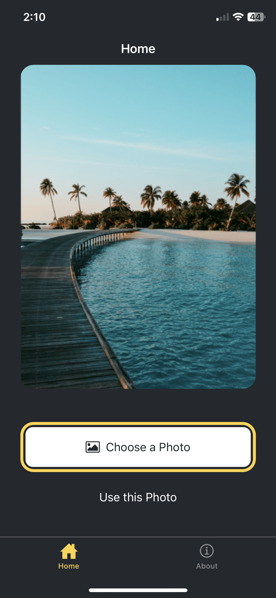
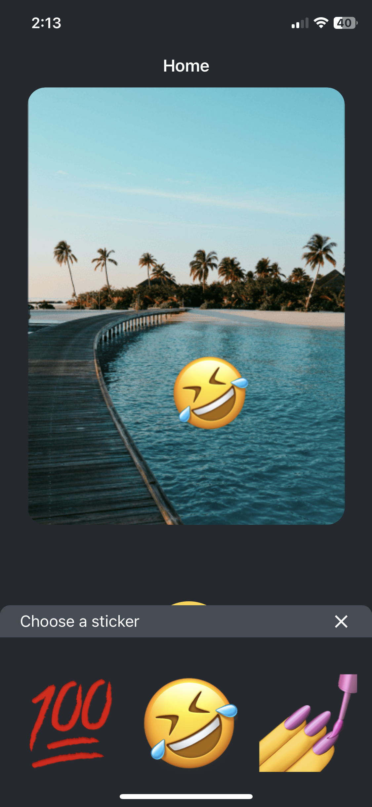
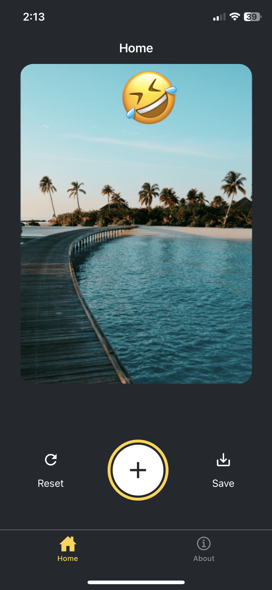

# StickerSmash App 🎨

Welcome to StickerSmash - a fun and creative mobile application that allows you to add stickers and emojis to your photos!

## Project Showcase

Here are some screenshots of the StickerSmash app in action:

<div style="display: flex; flex-wrap: wrap; gap: 10px;">
  
  
  
  
</div>

## Get started

1. Install dependencies

   ```bash
   npm install
   ```

2. Start the app

   ```bash
   npx expo start
   ```

## Get a fresh project

When you're ready, run:

```bash
npm run reset-project
```

This command will move the starter code to the **app-example** directory and create a blank **app** directory where you can start developing.

## Learn more

To learn more about developing your project with Expo, look at the following resources:

- [Expo documentation](https://docs.expo.dev/): Learn fundamentals, or go into advanced topics with our [guides](https://docs.expo.dev/guides).
- [Learn Expo tutorial](https://docs.expo.dev/tutorial/introduction/): Follow a step-by-step tutorial where you'll create a project that runs on Android, iOS, and the web.
